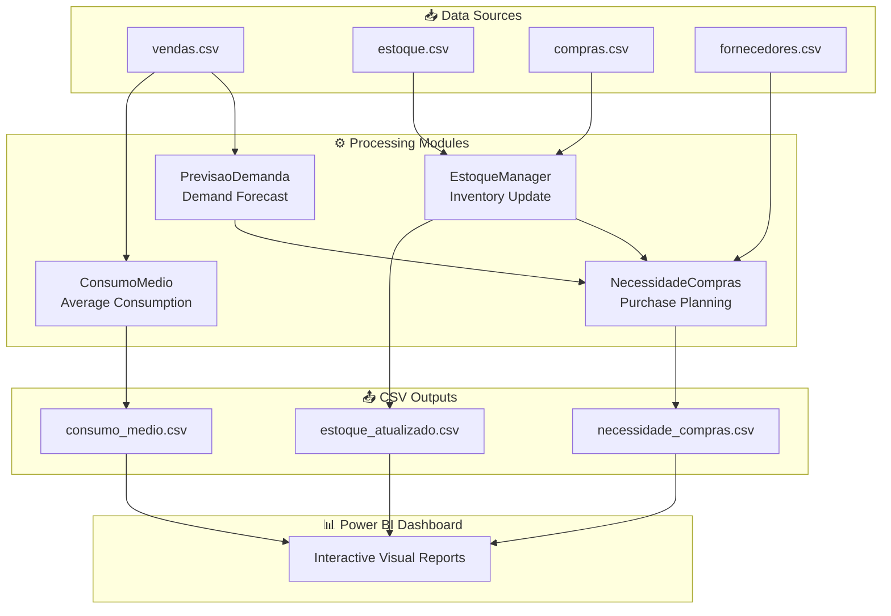

# 📘 README - Demand forecasting, purchase planning and inventory management system

## Overview

This project implements a complete demand‑forecasting and inventory‑management pipeline, fully modular and object‑oriented. The goal is to enable any operation - restaurants, retail, manufacturing, or distribution - to answer four essential questions:

- What was sold??
- How much will I sell?
- How much do I need to buy?
- How much stock do I currently have?

The system automates the entire process, from reading raw data to generating purchase requirements and updating inventory levels.

## Project architecture

The structure is designed for clarity, modularity, and maintainability:

```
/projeto_previsao/
│
├── data/
│   ├── estoque.csv
│   ├── vendas.csv
│   ├── compras.csv
│   ├── fornecedores.csv
│
├── modules/
│   ├── consumo.py
│   ├── previsao.py
│   ├── necessidade.py
│   ├── estoque.py
│
├── main.py
└── README.md
```

Each module contains a single class with a well‑defined responsibility, following clean architecture principles.

## Main components: 

### 1️. ConsumoMedio (modules/consumo.py)
Responsible for analyzing historical sales and calculating:

- average daily consumption (7, 15, 30, 90 days)
- consumption trend (increasing, decreasing, stable)

This class transforms raw sales data into meaningful indicators for forecasting.

### 2️. PrevisaoDemanda (modules/previsao.py)
Generates future demand forecasts using Facebook Prophet, an advanced statistical model capable of capturing:

- trend
- weekly seasonality
- yearly seasonality
- natural consumption variations

It estimates future consumption for a defined period (e.g., the next 15 days).

### 3️. NecessidadeCompras (modules/necessidade.py)
Calculates how much needs to be purchased, considering:

- forecasted demand
- current inventory
- incoming purchase orders
- supplier lead time
- target stock level

General formula:
necessity = max(target_stock - (current_stock + incoming_purchases), 0)
In other words: it only recommends purchasing when stock is insufficient

### 4️. EstoqueManager (modules/estoque.py)
Automatically updates inventory by:

- subtracting sales
- adding received purchases
- keeping stock levels accurate and up to date

This ensures the system always works with real, reliable data.

## Fluxo Completo do Sistema 
The main.py file orchestrates the entire pipeline:

### 1. Load data:

- inventory
- sales
- purchases
- suppliers

### 2. Update inventory:

- apply sales from the latest day
- apply received purchases

### 3. Calculate average consumption for each product:

- 7‑day consumption
- 15‑day consumption
- 30‑day consumption
- 90‑day consumption
- trend

### 4. Generate demand forecast:
Using Prophet, estimate future consumption (e.g., next 15 days).

### 5. Calculate purchase requirements based on:

- forecast
- current stock
- incoming purchases
- target stock level

### 6. Generate .csv reports:
- purchase requirements
- updated inventory


## PBI integration

The final stage of this project consists of connecting the generated .csv reports to Power BI in order to visualize the entire forecasting and inventory‑management pipeline through interactive dashboards. This integration transforms the forecasting engine into a complete decision‑support system, allowing managers to monitor stock, anticipate shortages, and plan purchases visually and intuitively.

## System architecture diagram



# Next Steps and Improvements

- Implement a database (possibly SQL) to store and update data more efficiently
- Automate files that still require manual updates in this version (purchases and suppliers)